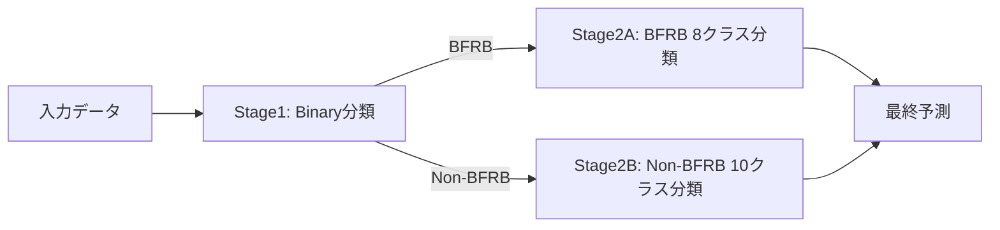

# 🗺️ IMUモデル改善実装ロードマップ

## 📋 現状の課題サマリー

### スコア分析
| メトリクス | 現在値 | 目標値 | ギャップ |
|----------|--------|--------|---------|
| **全体スコア** | 0.709 | 0.770 | +0.061 |
| **Binary F1** | 0.942 | 0.940+ | 維持 |
| **Macro F1** | 0.475 | 0.600 | +0.125 |

### 根本原因
- ✅ BFRBの検出は成功している
- ❌ BFRB内の8クラス分類が失敗
- ❌ クラス間の特徴が不十分

---

## 🎯 改善アプローチ

### アプローチ1: 二段階分類システム【推奨】



**メリット:**
- Binary F1の高さを活かせる
- 各段階で最適化可能
- クラスバランシングが容易

**実装コスト:** 低（2-3日）

### アプローチ2: 階層的分類

```
Level 1: BFRB vs Non-BFRB
Level 2: BFRB subcategories
  ├─ Hair pulling (4 classes)
  │   ├─ Above ear - pull hair
  │   ├─ Eyebrow - pull hair
  │   ├─ Eyelash - pull hair
  │   └─ Forehead - pull hairline
  ├─ Skin manipulation (2 classes)
  │   ├─ Cheek - pinch skin
  │   └─ Neck - pinch skin
  └─ Scratching (2 classes)
      ├─ Forehead - scratch
      └─ Neck - scratch
```

**メリット:**
- 類似行動をグループ化
- 段階的な精度向上
- 解釈性が高い

**実装コスト:** 中（4-5日）

### アプローチ3: マルチタスク学習

```python
# 複数の目的関数を同時最適化
loss = α * binary_loss + β * multiclass_loss + γ * contrastive_loss
```

**メリット:**
- End-to-endの学習
- 特徴表現の共有
- 最新の深層学習手法

**実装コスト:** 高（1週間以上）

---

## 📅 実装スケジュール

### Week 1: 即効性の高い改善

#### Day 1-2: 二段階分類の実装
- [ ] `TwoStageClassifier`クラスの実装
- [ ] Binary modelの訓練
- [ ] BFRB/Non-BFRB別モデルの訓練
- [ ] 検証とスコア計測

#### Day 3-4: クラスバランシング
- [ ] BFRBクラスの分布分析
- [ ] SMOTEの実装
- [ ] クラスウェイトの最適化
- [ ] 交差検証での評価

#### Day 5-6: 特徴量の微調整
- [ ] 特徴量重要度の分析
- [ ] 不要な特徴量の削除
- [ ] BFRB特化特徴量の追加
- [ ] 特徴量選択の自動化

**期待される改善:** 0.709 → 0.730

### Week 2: 特徴量エンジニアリングの強化

#### Day 7-8: Linear Acceleration
- [ ] Butterworthフィルタの実装
- [ ] 重力成分の動的推定
- [ ] 線形加速度の抽出
- [ ] 特徴量への統合

#### Day 9-10: 高度な周波数特徴
- [ ] ウェーブレット変換
- [ ] メル周波数ケプストラム係数(MFCC)
- [ ] スペクトログラムの時間変化
- [ ] クロススペクトル密度

#### Day 11-12: 時系列パターン
- [ ] DTWテンプレートマッチング
- [ ] Shapeletの抽出
- [ ] 反復パターンの検出
- [ ] 動作の開始/終了検出

**期待される改善:** 0.730 → 0.750

### Week 3: 深層学習とアンサンブル

#### Day 13-14: 1D-CNNモデル
- [ ] データローダーの実装
- [ ] CNNアーキテクチャ設計
- [ ] 訓練パイプライン
- [ ] ハイパーパラメータ調整

#### Day 15-16: BiLSTM追加
- [ ] CNN + BiLSTMの統合
- [ ] Attention機構の追加
- [ ] 残差接続
- [ ] バッチ正規化

#### Day 17-18: アンサンブル最適化
- [ ] OOF予測の生成
- [ ] スタッキングの実装
- [ ] 重み最適化
- [ ] 最終調整

**期待される改善:** 0.750 → 0.770+

---

## 📁 ディレクトリ構造

```
3_IMU_two_stage_classification/
├── config/
│   ├── stage1_binary.yaml      # Binary分類設定
│   ├── stage2_bfrb.yaml        # BFRB 8クラス設定
│   └── stage2_non_bfrb.yaml    # Non-BFRB 10クラス設定
├── src/
│   ├── two_stage_classifier.py # 二段階分類器
│   ├── data_balancing.py       # クラスバランシング
│   ├── linear_acceleration.py  # 線形加速度
│   ├── advanced_features.py    # 高度な特徴量
│   ├── deep_models.py          # 深層学習モデル
│   └── ensemble.py             # アンサンブル
├── notebooks/
│   ├── 01_eda_class_imbalance.ipynb
│   ├── 02_two_stage_training.ipynb
│   ├── 03_feature_importance.ipynb
│   └── 04_ensemble_optimization.ipynb
├── experiments/
│   ├── exp001_baseline/        # 現在のモデル
│   ├── exp002_two_stage/       # 二段階分類
│   ├── exp003_balanced/        # バランシング
│   └── exp004_deep_learning/   # 深層学習
└── results/
    ├── cv_scores.csv
    ├── confusion_matrices/
    └── feature_importance/
```

---

## 🔬 実験管理

### 実験トラッキング
```python
# experiments/tracking.py

class ExperimentTracker:
    def __init__(self, exp_name):
        self.exp_name = exp_name
        self.metrics = {}
        
    def log_metrics(self, fold, metrics):
        """各Foldのメトリクスを記録"""
        self.metrics[fold] = {
            'binary_f1': metrics['binary_f1'],
            'macro_f1': metrics['macro_f1'],
            'per_class_f1': metrics['per_class_f1'],
            'confusion_matrix': metrics['confusion_matrix']
        }
    
    def save_results(self):
        """結果をMLflowやWandBに保存"""
        pass
```

### A/Bテスト設計
| 実験ID | ベースライン | 変更点 | 期待効果 |
|--------|------------|--------|---------|
| exp002 | exp001 | 二段階分類 | Macro F1 +0.05 |
| exp003 | exp002 | SMOTE | Macro F1 +0.03 |
| exp004 | exp003 | Linear Acc | 全体 +0.02 |
| exp005 | exp004 | 深層学習 | 全体 +0.03 |

---

## 🚦 リスクと対策

### リスク1: 過学習
**症状:** CV高、LB低
**対策:** 
- より強い正則化
- ドロップアウト増加
- データ拡張

### リスク2: 計算時間
**症状:** 訓練が遅い
**対策:**
- 特徴量削減
- モデル軽量化
- 並列処理

### リスク3: メモリ不足
**症状:** OOM エラー
**対策:**
- バッチ処理
- 特徴量の段階的計算
- float32 → float16

---

## ✅ チェックリスト

### 実装前の確認
- [ ] データの品質確認
- [ ] クラス分布の可視化
- [ ] ベースラインの再現
- [ ] 評価指標の理解

### 実装中の確認
- [ ] 単体テストの作成
- [ ] クロスバリデーションの一貫性
- [ ] 特徴量のスケーリング
- [ ] 再現性の確保（seed固定）

### 実装後の確認
- [ ] 過学習のチェック
- [ ] 推論時間の測定
- [ ] メモリ使用量の確認
- [ ] 提出ファイルの検証

---

## 📝 参考実装

### 二段階分類の核心部分
```python
class TwoStageClassifier:
    def predict_proba(self, X):
        # Stage 1: Binary prediction
        binary_proba = self.binary_model.predict_proba(X)
        
        # Initialize final probabilities
        final_proba = np.zeros((len(X), 18))
        
        # Stage 2: Conditional prediction
        for i in range(len(X)):
            if binary_proba[i, 1] > 0.5:  # BFRB
                bfrb_proba = self.bfrb_model.predict_proba(X[i:i+1])
                final_proba[i, :8] = binary_proba[i, 1] * bfrb_proba[0]
            else:  # Non-BFRB
                non_bfrb_proba = self.non_bfrb_model.predict_proba(X[i:i+1])
                final_proba[i, 8:] = binary_proba[i, 0] * non_bfrb_proba[0]
        
        return final_proba
```

### クラスバランシングの実装
```python
def create_balanced_dataset(X, y):
    # BFRBクラスの分離
    bfrb_indices = np.where(y < 8)[0]
    non_bfrb_indices = np.where(y >= 8)[0]
    
    # BFRBクラスのバランシング
    X_bfrb = X[bfrb_indices]
    y_bfrb = y[bfrb_indices]
    
    # 各クラスのサンプル数を揃える
    max_samples = np.max(np.bincount(y_bfrb))
    balanced_indices = []
    
    for cls in range(8):
        cls_indices = np.where(y_bfrb == cls)[0]
        n_samples = len(cls_indices)
        
        if n_samples < max_samples:
            # オーバーサンプリング
            additional = np.random.choice(cls_indices, 
                                        max_samples - n_samples,
                                        replace=True)
            cls_indices = np.concatenate([cls_indices, additional])
        
        balanced_indices.extend(cls_indices)
    
    # 結合
    X_balanced = np.vstack([X_bfrb[balanced_indices], 
                           X[non_bfrb_indices]])
    y_balanced = np.concatenate([y_bfrb[balanced_indices],
                                y[non_bfrb_indices]])
    
    return X_balanced, y_balanced
```

---

## 🎯 成功の定義

### 短期目標（1週間）
- ✅ Macro F1 > 0.52
- ✅ 二段階分類の実装完了
- ✅ クラスバランシング完了

### 中期目標（2週間）
- ⬜ Macro F1 > 0.56
- ⬜ 全体スコア > 0.75
- ⬜ 特徴量最適化完了

### 長期目標（3週間）
- ⬜ Macro F1 > 0.60
- ⬜ 全体スコア > 0.77
- ⬜ Top 20%達成

---

*Document Version: 1.0*  
*Created: 2025-01-13*  
*Next Review: 2025-01-20*